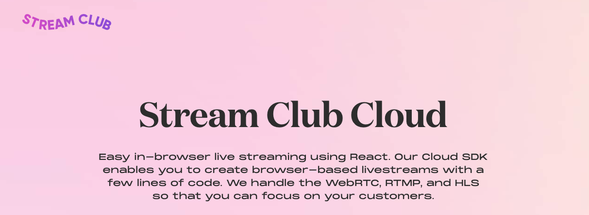
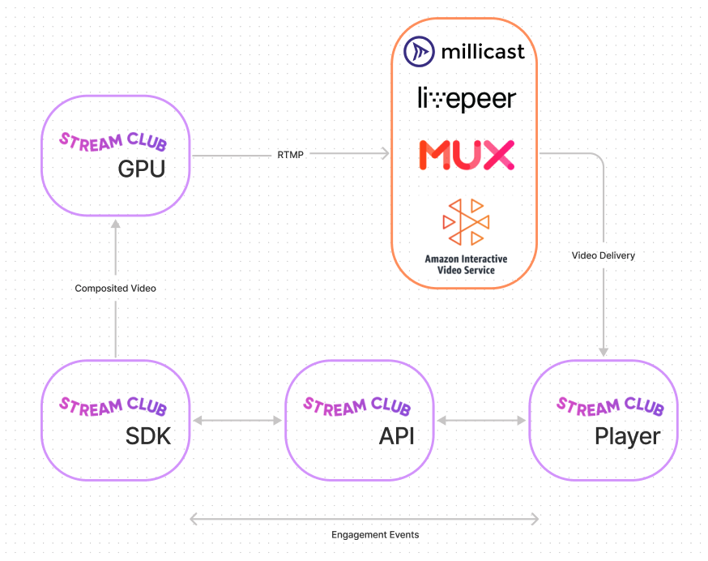

Stream Club is an in-browser live streaming studio focused on managing the complexity of designing and broadcasting so our users don’t have to. With Stream Club, users have the ability to customize livestreams in ways that were previously too complicated, cost-prohibitive, or even impossible.

Stream Club Cloud brings this simplicity to your live broadcasting applications. Stream Club Cloud provides the infrastructure for:

-   Easily embeddable in-browser live streaming
-   Building a live streaming product as quickly as possible
-   Live streaming that anyone can understand and interact with

# Getting Started with Stream-SDK-Demo

This project was bootstrapped with [Create React App](https://github.com/facebook/create-react-app).

## Available Scripts

In the project directory, you can run:

### `yarn start`

Which runs the app in the development mode. Open [http://localhost:3000](http://localhost:3000) to view it in the browser. You'll be prompted to enter your Stream Club Cloud API Keys to configure the demo.

# Introducing the Stream Club Cloud

Stream Club Cloud is an [SDK](https://www.notion.so/Studio-SDK-Docs-328d6717d5b14a6c8100e5fa54af5c74) + [API](https://www.notion.so/Studio-API-Docs-335772b508214612890d496dfd1a45da) to power your custom-built, live video applications.

Our library includes a host of plug & play features to power your applications:

-   Customization of live stream appearance in a browser-based GUI (including automatic handling of video and asset composition into a single video stream)
-   Cloud video encoding, offloading the work from the browser
-   Syncing of a live stream state across browsers
-   Managed WebRTC for cohosting

**Sign up for beta access here: [https://www.stream.club/cloud](https://www.stream.club/cloud)**

## How does it work?

Check out our docs:

[Studio SDK Docs](https://www.notion.so/Studio-SDK-Docs-328d6717d5b14a6c8100e5fa54af5c74)

[Studio API Docs](https://www.notion.so/Studio-API-Docs-335772b508214612890d496dfd1a45da)

Here's a live demo!

[https://www.loom.com/share/2b2e7f528f334f108531b6a93b121d6f](https://www.loom.com/share/2b2e7f528f334f108531b6a93b121d6f)

# Stream Club Cloud: Powered by a Proven Platform

We're our own first customer and have been running this infrastructure in production for several months now. We built our own auto-scaling GPU rebroadcasting architecture because nobody else offered a product of comparable quality. We use a blend of cloud encoders to perfectly deliver on a variety of customer requirements. This stack has proven to be very reliable and cost effective.

## **Our beliefs:**

**We believe that you should only need one application to create great live streams.**

Apple has the best product experiences because their ecosystem is integrated. Your Airpods pair seamlessly with your iPhone. Using livestreaming software should feel like that—connected.

**Creating live video content is scary, so the software has to be friendly.**

Our customers don't want to know about b-frames or RTMP, they just want their video to look great. Our job is to abstract away the complexity of live video and empower those building great products.

**Live video becomes powerful when you add engagement.**

[Donations](https://www.youtube.com/watch?v=c2MjSFGVTgU), [chat](https://www.youtube.com/watch?v=OSxVhL9xuS8), and [viewer interactions](https://twitter.com/thecodemiko/status/1407490120790413314) are really just the beginning of viewer engagement. [Twitch Plays Pokemon](https://en.wikipedia.org/wiki/Twitch_Plays_Pok%C3%A9mon) showed us what's possible if you get creative with how viewers can interact with a live stream. The limiting factor of innovation has been software complexity.

**The best live streaming application will be platform first.**

To truly have a seamless experience, the place you create live streams and the place you watch live streams must be built together, not separately. They need to be able to talk to each other and be symbiotic. They must run on the same platform.

## **Questions? Want to learn more?**

Get in touch at [api-support@stream.club](mailto:api-support@stream.club). We’re happy to help.
